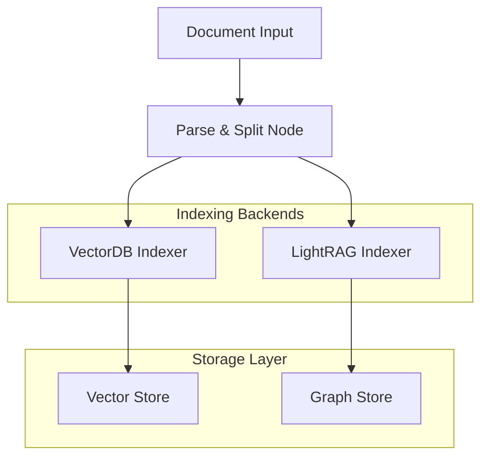

# Archivist

> 🗃️ **Advanced Document Indexing Agent** - A sophisticated document management and indexing system within the PAKTON multi-agent framework

## 📋 Table of Contents

- [Overview](#overview)
- [Key Features](#key-features)
- [Architecture](#architecture)
- [Installation](#installation)
- [Configuration](#configuration)
- [Usage](#usage)
- [API Reference](#api-reference)
- [Examples](#examples)
- [Supported File Formats](#supported-file-formats)
- [Contributing](#contributing)
- [License](#license)

## 🔍 Overview

Archivist is a cutting-edge document management and indexing agent designed to process, store, and create searchable indexes of various document formats. Built on a modular architecture using LangGraph, it enables efficient information retrieval for knowledge-intensive tasks through multiple indexing strategies and vector database integration.

### Core Capabilities

- **Multi-Backend Indexing**: Support for Vector databases (Pinecone, ChromaDB) and LightRAG graph-based indexing
- **Intelligent Document Processing**: Advanced parsing and chunking strategies for optimal retrieval
- **Graph-Based Workflow**: StateGraph implementation for parallel processing and robust error handling
- **Flexible Configuration**: YAML-based configuration with environment variable support
- **Production Ready**: Comprehensive logging, error handling, and monitoring capabilities

## ✨ Key Features

### 🎯 Multi-Format Document Processing
- **PDF Documents**: Full text extraction with metadata preservation
- **Word Documents**: Native support for .doc and .docx files
- **Text Files**: Direct processing of plain text documents
- **Structured Parsing**: Choice between naive and structural parsing strategies

### 🚀 Advanced Indexing Techniques
- **Vector Database Integration**: Seamless connection with Pinecone and ChromaDB
- **Hybrid Search Capabilities**: Combines traditional search with vector embeddings
- **LightRAG Support**: Graph-based indexing for complex document relationships
- **Parallel Processing**: Concurrent indexing across multiple backends

### 🔧 Enterprise Features
- **Configurable Chunking**: Customizable chunk sizes and overlap strategies
- **Metadata Management**: Preserves and indexes document metadata
- **Monitoring & Logging**: Comprehensive logging with rotation and retention
- **Memory Management**: Efficient state management with checkpointing

## 🏗️ Architecture

Archivist follows a modular, graph-based architecture:



### Core Components

1. **Agent (agent.py)**: Main orchestration layer managing the indexing workflow
2. **Graph Builder (graph/builder.py)**: Constructs and compiles StateGraph workflows
3. **Indexers**: Pluggable backends for different storage strategies
   - **VectorDB Indexer**: Vector similarity search using embeddings
   - **LightRAG Indexer**: Graph-based indexing for relationship modeling
4. **Parser**: Document processing with chunking strategies
5. **Models**: LLM integration for AWS Bedrock and OpenAI
6. **Types**: TypedDict definitions for state management

## 📦 Installation

### Prerequisites

- **Python**: 3.11 or higher
- **API Keys**: Required for various services (see Configuration section)
- **Memory**: Sufficient RAM for processing large documents

### Method 1: Development Installation

```bash
# Clone the repository
cd /path/to/PAKTON/Framework/Archivist

# Install in development mode
pip install -e .
```

### Method 2: Package Installation

```bash
# Install from package
pip install .
```

### Method 3: Direct Requirements

```bash
# Install dependencies directly
pip install -r requirements.txt
```

## ⚙️ Configuration

### Environment Variables

Create a `.env` file based on the provided template:

```bash
cp src/Archivist/.env.example src/Archivist/.env
```

#### Required API Keys

```bash
# OpenAI (Required for embeddings)
OPENAI_API_KEY=your_openai_api_key
EMBEDDINGS_API_KEY=your_openai_embeddings_api_key

# Pinecone (Required if using Pinecone vector store)
PINECONE_API_KEY=your_pinecone_api_key

# AWS (Required if using Bedrock models)
AWS_ACCESS_KEY_ID=your_aws_access_key_id
AWS_SECRET_ACCESS_KEY=your_aws_secret_access_key
AWS_REGION_NAME=your_aws_region

# Hugging Face (Required for certain embedding models)
HUGGINGFACE_TOKEN=your_huggingface_token

# LangChain (Optional - for monitoring)
LANGCHAIN_TRACING_V2=true
LANGCHAIN_PROJECT=your_project_name
LANGCHAIN_API_KEY=your_langchain_api_key

# Tavily (Optional - for enhanced search)
TAVILY_API_KEY=your_tavily_api_key
```

### Configuration File (config.yaml)

Create a `config.yaml` file based on the provided template:

```bash
cp src/Archivist/config.example.yaml src/Archivist/config.yaml
```

The `config.yaml` file provides fine-grained control over Archivist behavior:

```yaml
# Indexing Backends
indexers:
  vectordb:
    use_vector_store: "chroma"  # "pinecone" or "chroma"
    pinecone:
      INDEX_NAME: "your-index"
      API_HOST: "your-pinecone-host"
    chroma:
      INDEX_NAME: "documents"
      persist_directory: "./chroma_db"
      metadata:
        hnsw:M: 100
        hnsw:construction_ef: 500
        hnsw:search_ef: 1000
  
  lightrag:
    base_url: "http://localhost:9621"
    clear_existing: true
    max_polling_time: 300

# Document Processing
parser:
  type: "naive"  # "naive" or "structural"
  naive:
    chunk_size: 1000
    chunk_overlap: 200

# Model Configuration
models:
  API: "OPENAI"  # "OPENAI" or "BEDROCK"
  model_id: "gpt-4o"
  args:
    temperature: 0

# Logging
logging:
  level: "INFO"
  file: "archivist.log"
  format: "[%(asctime)s] [%(name)s] [%(levelname)s] [%(message)s]"
  rotation: "10MB"
  retention: "10 days"
  console_output: true

# Visualization (for Jupyter notebooks)
visualization: false
```

## 🚀 Usage

### Basic Usage

```python
from Archivist import Archivist

# Initialize with default configuration
archivist = Archivist()

# Index a document
result = archivist.index("path/to/document.pdf")
print(f"Indexing status: {result.get('status')}")
```

### Advanced Configuration

```python
from Archivist import Archivist

# Configure with multiple backends
config = {
    "enable_vectordb": True,      # Enable vector database
    "enable_lightrag": True,      # Enable graph-based indexing
    "run_name": "Legal Documents" # Name for this indexing run
}

# Initialize with configuration
archivist = Archivist(config=config)

# Index with custom parameters
result = archivist.index(
    filePath="contracts/contract-001.pdf",
    config={
        "chunk_size": 1500,
        "chunk_overlap": 300
    }
)
```

### Using with Different Vector Stores

#### Pinecone Setup

```python
# Configure for Pinecone
config = {
    "enable_vectordb": True,
    "run_name": "Pinecone Indexing"
}

archivist = Archivist(config=config)
# Ensure config.yaml has pinecone settings configured
```

#### ChromaDB Setup

```python
# Configure for ChromaDB
config = {
    "enable_vectordb": True,
    "run_name": "ChromaDB Indexing"
}

archivist = Archivist(config=config)
# Ensure config.yaml has chroma settings configured
```

### Error Handling

```python
try:
    result = archivist.index("document.pdf")
    if result.get("status") == "error":
        print(f"Indexing failed: {result.get('error')}")
    else:
        print("Document indexed successfully!")
except Exception as e:
    print(f"Unexpected error: {str(e)}")
```

## 📚 API Reference

### Archivist Class

#### Constructor

```python
Archivist(config: Optional[Dict[str, Any]] = None)
```

**Parameters:**
- `config` (dict, optional): Configuration dictionary for the agent

**Configuration Options:**
- `enable_vectordb` (bool): Enable vector database indexing
- `enable_lightrag` (bool): Enable LightRAG graph indexing
- `run_name` (str): Name for the indexing run
- `memory_saver` (MemorySaver): Custom memory saver for checkpointing

#### Methods

##### index()

```python
index(filePath: str, config: Optional[Dict[str, Any]] = None) -> Dict[str, Any]
```

Index a document from the specified file path.

**Parameters:**
- `filePath` (str): Absolute path to the document to index
- `config` (dict, optional): Override configuration for this indexing operation

**Returns:**
- `dict`: Results of the indexing operation containing status and metadata

**Example:**
```python
result = archivist.index("/path/to/document.pdf")
```

## 💡 Examples

### Example 1: Simple Document Indexing

```python
from Archivist import Archivist

# Basic setup
archivist = Archivist({"enable_vectordb": True})

# Index a PDF document
result = archivist.index("research-paper.pdf")
```

### Example 2: Multi-Backend Indexing

```python
from Archivist import Archivist

# Enable both vector and graph indexing
config = {
    "enable_vectordb": True,
    "enable_lightrag": True,
    "run_name": "Comprehensive Indexing"
}

archivist = Archivist(config=config)

# Index multiple documents
documents = ["doc1.pdf", "doc2.docx", "doc3.txt"]
for doc in documents:
    result = archivist.index(doc)
    print(f"Indexed {doc}: {result.get('status')}")
```

### Example 3: Custom Chunking Strategy

```python
from Archivist import Archivist

# Initialize archivist
archivist = Archivist({"enable_vectordb": True})

# Index with custom chunking
result = archivist.index(
    "large-document.pdf",
    config={
        "chunk_size": 2000,
        "chunk_overlap": 400
    }
)
```

### Example 4: Jupyter Notebook Usage

See `examples/notebooks/testing.ipynb` for a complete notebook example.

```python
# In a Jupyter cell
from Archivist import Archivist

# Enable visualization for notebooks
config = {
    "enable_vectordb": True,
    "run_name": "Notebook Demo"
}

archivist = Archivist(config=config)
result = archivist.index("sample-document.pdf")
```

## 📄 Supported File Formats

| Format | Extension | Processing Method |
|--------|-----------|-------------------|
| PDF | `.pdf` | PyPDF extraction with metadata |
| Word Document | `.doc`, `.docx` | python-docx and docx2txt |
| Plain Text | `.txt` | Direct text processing |

## 🔧 Advanced Topics

### Custom Indexers

Extend the `BaseIndexer` class to create custom indexing backends:

```python
from Archivist.indexers.base import BaseIndexer

class CustomIndexer(BaseIndexer):
    @property
    def name(self) -> str:
        return "custom_indexer"
    
    def index(self, docs: List[Document], **kwargs) -> None:
        # Custom indexing logic
        pass
```

### Graph Visualization

Enable graph visualization in Jupyter notebooks:

```python
# In config.yaml
visualization: true
```

### Memory Management

Configure custom memory savers for large-scale operations:

```python
from langgraph.checkpoint.memory import MemorySaver

custom_memory = MemorySaver()
config = {
    "memory_saver": custom_memory,
    "enable_vectordb": True
}

archivist = Archivist(config=config)
```

## 🧪 Testing

Run the test suite to ensure proper functionality:

```bash
# Run basic functionality test
python examples/simple_query.py

# Run notebook tests
jupyter notebook examples/notebooks/testing.ipynb
```

## 📝 Logging

Archivist provides comprehensive logging capabilities:

- **Log Levels**: DEBUG, INFO, WARNING, ERROR
- **Log Rotation**: Automatic rotation based on file size
- **Log Retention**: Configurable retention periods
- **Console Output**: Optional stdout logging

### Log Configuration

```yaml
logging:
  level: "INFO"
  file: "archivist.log"
  rotation: "10MB"
  retention: "10 days"
  console_output: true
```

## 👨‍💻 Author

**Raptopoulos Petros**  
📧 petrosrapto@gmail.com